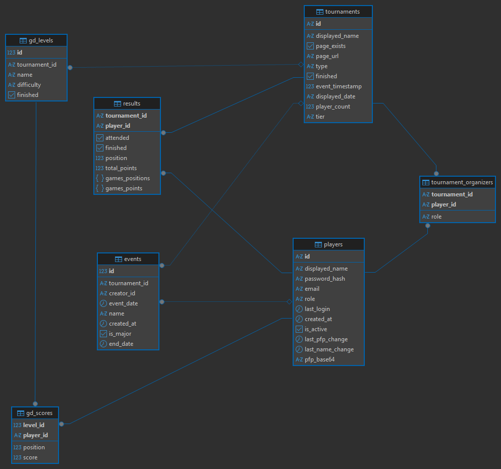

# KKOL API

Welcome to the backend API documentation. 

**Base URLs:**
* Local: `http://localhost:3000`
* Prod: `https://kkol.pl`

**Authentication:** All protected routes require a JWT passed via the `auth_token` cookie. [Read more about Authentication here.](./docs/api/basics/authentication.md)

---

## 🗂️ API Directory

### Authentication
* [**Login** (`POST /api/login`)](./docs/api/auth/login.md)
* [**Logout** (`POST /api/logout`)](./docs/api/auth/logout.md)

### Events
* [**Fetch Event** (`POST /api/events`)](./docs/api/events/events.md)
* [**Create Event** (`POST /api/event_create`)](./docs/api/events/event_create.md)
* [**Update Event** (`POST /api/event_update`)](./docs/api/events/event_update.md)
* [**Delete Event** (`POST /api/event_delete`)](./docs/api/events/event_delete.md)

### Tournaments
* [**Fetch Tournaments** (`GET /api/tournaments`)](./docs/api/tournaments/tournaments.md)
* [**Get Active Tournaments** (`GET /api/tournaments_active`)](./docs/api/tournaments/tournaments_active.md)
* [**Tournament Editor Details** (`GET /api/tournament_editor_details`)](./docs/api/tournaments/tournament_editor_details.md)
* [**Save Tournament Results and Details** (`POST /api/tournament_save_results`)](./docs/api/tournaments/tournament_save_results.md)
* [**Toggle Attendance** (`POST /api/tournament_toggle_attendance`)](./docs/api/tournaments/tournament_toggle_attendance.md)
* [**Update Organizer Role** (`POST /api/tournament_update_organizer_role`)](./docs/api/tournaments/tournament_update_organizer_role.md)
* [**Create Tournament** (`POST /api/tournament_create`)](./docs/api/tournaments/tournament_create.md)
* [**Delete Tournament** (`POST /api/tournament_delete`)](./docs/api/tournaments/tournament_delete.md)
* [**Change Tournament Tier** (`POST /api/tournament_change_tier`)](./docs/api/tournaments/tournament_change_tier.md)
* [**Add Player** (`POST /api/tournament_add_player`)](./docs/api/tournaments/tournament_add_player.md)
* [**Kick Player** (`POST /api/tournament_kick_player`)](./docs/api/tournaments/tournament_kick_player.md)
* [**Leave Tournament** (`POST /api/tournament_leave`)](./docs/api/tournaments/tournament_leave.md)

### Players
* [**Me** (`GET /api/me`)](./docs/api/players/me.md)
* [**Fetch Players** (`GET /api/players`)](./docs/api/players/players.md)
* [**Fetch KKOL Ranking** (`GET /api/ranking`)](./docs/api/players/ranking.md)
* [**Change Name** (`POST /api/change_name`)](./docs/api/players/change_name.md)
* [**Upload Profile Picture** (`POST /api/upload_pfp`)](./docs/api/players/upload_pfp.md)

### GD
* [**GD Data** (`GET /api/gd`)](./docs/api/gd/gd.md)

---

## 📑 Database Diagram

